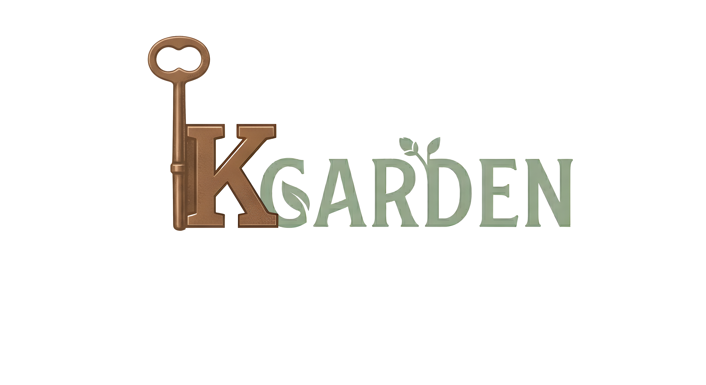

# Direction artistique

> Miroir texte de la page Notion 🎨 *Design & Maquettes*. Sources : `Brainstorming_G13.pdf`, `K-GARDEN (6).pdf`, maquette Figma.

## Logo
Un **K** formé par une **clé bronze / cuivre** (rappel de l'évasion) accolé à **GARDEN** en **vert sauge**, avec une petite **pousse** — fusion des deux thèmes : la clé (sortir) et le jardin (cultiver). Fichier : `docs/logo.png`.

## Style visuel
- Brief initial : **naturel / minimaliste**, stylisé.
- Maquette finale : style **casual game illustré, chaleureux et coloré** (serre fleurie peinte). L'identité a évolué du « carnet botanique épuré » vers un rendu plus riche et immersif.

## Palette & typo
- Couleurs : **beige, marron, vert doux** (dominante verts → marrons).
- Police : **Jungle Adventurer**.

## Ambiance
- Calme, apaisante, organique — « fermée mais lumineuse, vivante, respirante ».
- Le **son** renforce la sensation de calme et d'évasion.
- **3D** choisie pour l'immersion et la profondeur.

## UX / Ergonomie / Accessibilité
- Interface claire, aérée, non surchargée ; compréhension en quelques secondes.
- Accessibilité pensée comme **centrale** : contrastes, lisibilité, hiérarchie de l'info, commandes simples.
- Démarche guidée par les **personae** (Nathan 12 ans, Lucas 19 ans).

## Environnement — la serre
- Serre fermée, table au centre (sprays engrais / anti-nuisibles + graines, arrosoir posé ailleurs).
- Une **dizaine de pots**, 5 de chaque côté, le long de la serre.
- Sol : carrelage de pierre (chemins de jardin) + terre battue.

## Maquette UI (Figma)
- Lien : https://www.figma.com/design/cQm0DyrjMIeNGap56erPnA/K-Garden?node-id=0-1
- 4 écrans (filaire + illustré) : **Accueil**, **HUD de jeu**, **Pause**, **Réglages**.
- Logo **K-Garden** avec **clé dorée** intégrée ; boutons en rectangles arrondis crème / bois ; décor clé + arrosoir.

## ⚠️ À faire
- **Décor de la serre** : à créer par l'équipe (pas une feature joueur) — non réalisé faute de temps.
- **Intégration de la maquette** : habiller les menus + le HUD (actuellement HUD provisoire en `OnGUI`).

## Assets disponibles dans le dépôt
- Plantes / nature : `Simple Nature Pack`, `eb_house_plant_01/02/03`, `flower`, `plant`.
- Mobilier / objets : `old_wooden_table`, `table_obj`, `Pots.obj`, `sprayer`.
- Sol & déco : `ground/`, `deco/`.
- Ciel : `BOXOPHOBIC – Skybox Cubemap Extended`. Texte : `TextMesh Pro`.
